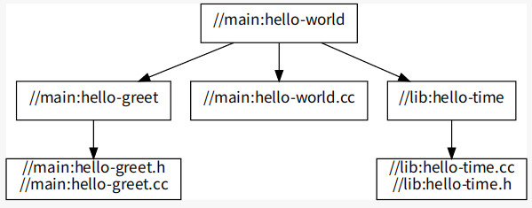

[TOC]

# 1.Bazel

[参考链接:Bazel overview](https://docs.bazel.build/versions/4.2.2/bazel-overview.html),

[(**非常推荐：总结的特别全面**) 参考链接：Bazel学习笔记](https://blog.gmem.cc/bazel-study-note)

## 简介

Bazel是一个开源的构建和测试工具，类似于Make、Maven和Gradle。它使用一种人类可读的高级构建语言。Bazel支持多种语言的项目，并为多个平台构建输出。Bazel支持跨多个存储库和大量用户的大型代码库。

## 为什么我应该用Bazel？

Bazel有以下的优势：

* **高级语言构建**. Bazel使用一种抽象的、人类可读的，语言在较高的语义级别上描述项目的构建属性。与其他工具不同，Bazel操作库、二进制文件、脚本和数据集的概念，使您不必编写对编译器和链接器等工具的单独调用。
* **Bazel快速可靠**. Bazel缓存所有以前完成的工作，并跟踪文件内容和构建命令的更改。这样，Bazel就知道什么时候需要重建，并且只重建它。为了进一步加快构建的速度，您可以将项目设置为以高度并行和增量的方式构建。
* **Bazel是多平台的**. Bazel可以在Linux、macOS和Windows上运行。Bazel可以在同一个项目中为多个平台(包括桌面、服务器和移动平台)构建二进制文件和可部署的包。
* **Bazel规模**. Bazel在处理100k+源文件的构建时保持了敏捷性。它与数以万计的多个存储库和用户群一起工作。
* **Bazel是可扩展的**. 它支持多种语言，你可以扩展Bazel以支持任何其他语言和框架。

## 怎么使用Bazel？

要用Bazel构建或测试一个项目，你通常需要做到以下几点:

1. **Set up Bazel.** Download and [install Bazel](https://docs.bazel.build/versions/4.2.2/install.html).
2. **Set up a project [workspace](https://docs.bazel.build/versions/4.2.2/build-ref.html#workspaces)**, 这是一个目录，Bazel查找构建输入和构建文件，并存储构建输出。
3. **Write a `BUILD` file**, 告诉Bazel该构建什么以及如何构建。

​		你可以通过使用 [Starlark](https://docs.bazel.build/versions/4.2.2/skylark/language.html) (一种特定领域的语言)声明构建目标来编写构建文件。 (See example [here](https://github.com/bazelbuild/bazel/blob/master/examples/cpp/BUILD).)

​		构建目标指定了Bazel将构建的一组输入构件及其依赖项、Bazel将用于构建的构建规则以及配置构建规则的选项。

​		构建规则指定Bazel将使用的构建工具，如编译器和链接器，以及它们的配置。Bazel附带了许多构建规则，涵盖了受支持平台上受支		持语言中最常见的构建类型。

4. 运行**Bazel** 用命令行 [command line](https://docs.bazel.build/versions/4.2.2/command-line-reference.html). Bazel 将输出放到工作区中。

除了构建之外，还可以使用Bazel运行测试和查询构建，以跟踪代码中的依赖项。

## Bazel是怎么工作的？

当运行构建或测试时，Bazel会做以下操作：

1. 加载与目标相关的 `BUILD`文件.
2. 分析输入及其依赖关系([dependencies](https://docs.bazel.build/versions/4.2.2/build-ref.html#dependencies)), 应用指定的构建规则，并生成动作图([action](https://docs.bazel.build/versions/4.2.2/skylark/concepts.html#evaluation-model) graph).
3. 在输入上执行构建操作，直到生成最终的构建输出.

### 什么是动作图？

动作图表示构建工件之间的关系，以及Bazel将执行的构建操作。多亏了这张图，Bazel可以跟踪文件内容的更改以及操作的更改，比如构建或测试命令，并知道之前已经完成了哪些构建工作。此图还使你能够轻松地跟踪代码中的依赖项。

## 我怎么开始使用？

看 [Getting Started](https://docs.bazel.build/versions/4.2.2/getting-started.html) or 跳转到Bazel tutorials:

- [Tutorial: Build a C++ Project](https://docs.bazel.build/versions/4.2.2/tutorial/cpp.html)


# 2.Tutorial:Build a C++ Project

在本教程中，您将学习使用Bazel构建c++应用程序的基础知识。您将设置工作区并构建一个简单的c++项目，该项目演示了关键的Bazel概念，如目标和build文件。在完成本教程之后，看一看 [Common C++ Build Use Cases](https://docs.bazel.build/versions/4.2.2/cpp-use-cases.html) 构建用例，以了解更高级的概念，如编写和运行c++测试。

预估完成时间：30分钟。

## What you’ll learn

在本教程中，你将学习如何：

* 构建一个target
* 构思Project的依赖
* 分割Project成多个targets是和packages
* 控制packages之间的target可见性
* 通过labels标记targets

## Before you begin

请先安装Bazel( [Install Bazel](https://docs.bazel.build/versions/4.2.2/install.html) )， 然后，从Bazel的Github库中下载示例Project

cpp-tutorial的文件结构如下图所示：


有三组文件：

stage1: 构建只有一个package，package里只有一个target

stage2: 构建只有一个package，package里有多个targets

stage3: 项目中有多个package，package里有多个targets

## Build with Bazel

### Set up the workspace

在构建项目之前，需要设置其工作空间。工作区是存放项目的源文件和Bazel的构建输出的目录。它还包含Bazel识别为特殊的文件:

* 文件`WORKSPACE`, 它将该目录及其内容识别为Bazel工作空间，该文件**位于project结构的根目录**。
* 一个或多个`BUILD`文件, 告诉Bazel如何构建project的不同部分。(工作区中包含BUILD文件的目录是一个package)

要将一个目录指定为**Bazel的工作区**，请在该目录中创建一个名为**`WORKSPACE`的空文件**。

### Understand the BUILD file

一个`BUILD`文件包含了几种不同类型的Bazel指令。最重要的类型是*build rule*，它告诉Bazel如何构建所需的输出，例如可执行二进制文件或库。`BUILD`文件中构建规则的每个实例都称为target，并指向一组特定的源文件和依赖项。target还可以指向其它targets。

看一下cpp-tutorial/stage1主目录下的`BUILD`文件


在这个示例中,`hello-world` target实例化了Bazel内置的[`cc_binary` rule](https://docs.bazel.build/versions/4.2.2/be/c-cpp.html#cc_binary). 该规则告诉Bazel从hello-world构建一个自包含的可执行二进制文件，并且`hello-world.cc`源文件没有依赖关系。

target中的属性显示地表明了它的依赖项和选项。虽然`name`属性是强制性的，但许多属性是可选的。例如，在`hello-world` target中，`srcs`指定了Bazel用来构建target的源文件。

### Build the project

构建实例project的方法，进入`cpp-tutorial/stage1`目录，执行以下命令：

```shell
bazel build //main:hello-world
```

`//main:`是我们的`BUILD`文件相对于工作区根目录所在的位置(`BUILD`的位置：`stage1/main/BUILD`)

`hello-world`是在`BUILD`文件中我们为该目标的命名.也就是`BUILD`中`name`所对应的label

```shell
bazel clean  # 清除build的结果文件
```

生成类似下图结果，表示构建成功：


Bazel把构建的输出结果放到了工作区根目录的`bazel-bin`文件夹中。

现在，测试一下你刚构建的二进制程序：

```
bazel-bin/main/hello-world
```

### 查看依赖关系图

成功构建的所有依赖项都在`BUILD`文件中显式声明。Bazel使用这些语句创建项目的依赖关系图，从而实现精确的增量构建.

让我们可视化一下示例project的依赖关系。首先，生成依赖图的文本表示(在工作区根目录下运行该命令):

```shell
bazel query --notool_deps --noimplicit_deps "deps(//main:hello-world)" --output graph
#如果报错把--notool_deps替换成--nohost_deps
bazel query --nohost_deps --noimplicit_deps "deps(//main:hello-world)" --output graph
```


×××××××××××××报错了××××××××××××××××××如果出错把`--notool-deps`修改成`--nohost_deps`即可,[参考链接：tool_deps option is not supported for c++ projects #10056](https://github.com/bazelbuild/bazel/issues/10056)

上面的命令告诉Bazel寻找target`//main:hello-world`的所有依赖项(不包含host和隐式依赖项)，并将输出格式化为图形。

Then, paste the text into [GraphViz](http://www.webgraphviz.com/).（好像没什么反应。。。）

在Ubuntu上，你可以通过安装GraphViz和xdot查看器来本地查看图形:

```shell
sudo apt install graphviz xdot
```

然后你可以通过xdot来生成和查看图形。

```shell
xdot <(bazel query --notool_deps --noimplicit_deps "deps(//main:hello-world)" --output graph)
#如果报错把--notool_deps替换成--nohost_deps
xdot <(bazel query --nohost_deps --noimplicit_deps "deps(//main:hello-world)" --output graph)
```

××××××××××××××报错了，可能还是因为--notool_deps那个的问题××××××××××××××找到原因了，如果出错把`--notool-deps`修改成`--nohost_deps`即可

正如你所看到的，样例项目的stage1有一个单独的target，它构建了一个没有额外依赖的源文件：


接下来，增加一些复杂性。

## 完善你的 Bazel build

将较大的项目分割成多个target和package，以允许快速增量构建，并同时构建项目的多个部分来加快构建速度。

### 指定多个构建目标

将我们的示例项目构建分成两个目标。看`cpp-tutorial/stage2/main`主目录下的`BUILD`文件.


通过这个`BUILD`文件，Bazel首先构建`hello-greet`库(使用Bazel内置的 [`cc_library` rule ](https://docs.bazel.build/versions/4.2.2/be/c-cpp.html#cc_library)规则)，然后构建`hello-world`二进制文件。`hello-world`目标的deps属性告诉Bazel，要构建`hello-world`二进制文件，需要使用`hell0-greet`库.

构建这个project，进入`cpp-tutorial/stage2`目录，执行以下命令：

```shell
bazel build //main:hello-world
```

构建成功后，测试该二进制文件

```shell
bazel-bin/main/hello-world
```


如果现在修改`hello-greet.cc`文件并编译这个project，Bazel只会重新编译该文件。

查看依赖关系图，你可以看到hello-world依赖于和以前一样的输入，但是构建的结构不同了。

输入命令：

```
xdot <(bazel query --nohost_deps --noimplicit_deps "deps(//main:hello-world)" --output graph)
```

得到依赖图：


你可以看到`hello-world`依赖于和以前一样的输入，但是构建的结构不同了。

现在，你已经构建了带有两个target的project。`hello-world`目标构建了一个源文件和依赖于另一个target(//main:hello-greet).

### 使用多个packages

现在让我们将项目分解为多个packages，看`cpp-tutorial/stage3`目录的内容：


注意，现在我们有两个子目录，每个子目录都包含一个`BUILD`文件。所以，对于Bazel来说，工作区现在包含两个package，`lib`和`main`。

看一下`lib/BUILD`文件内容：


再看一下`main/BUILD`文件内容：


正如你所看到的，`main` package中的`hello-world`目标依赖`lib`中的`hello-time`目标(因此该目标的label是`//lib:hello-time`)，Bazel通过`deps`属性知道这一点。看看依赖关系图。

```
xdot <(bazel query --nohost_deps --noimplicit_deps "deps(//main:hello-world)" --output graph)
```



注意，为了让构建成功，我们使用`visibility`属性使`lib/BUILD`中的目标`//lib:hello-time`对于`main/BUILD`显示可见。这是因为默认情况下，target只对同一个BUILD文件中的其它target可见.(Bazel使用target visibility是用来防止包含实现细节的库泄漏到public APIs)。

让我们构建这个project的最终版本，进入`cpp-tutorial/stage3`目录，执行以下命令：

```shell
bazel build //main:hello-world
```

构建成功后，测试该二进制文件：

```
bazel-bin/main/hello-world
```


现在，你已经将project构建成两个包含3个target的package，并了解了它们之间的依赖关系

## 使用label来引用targets

在`BUILD`文件和命令行，Bazel使用*labels*来引用targets，例如`//main:hello-world`或`//main:hello-time`，他们的语法是：

```
//path/to/package:target-name
```

如果target是规则的target，则`path/to/package`是包含`BUILD`文件目录的路径，而`target-name`是您在`BUILD`文件中为target命令的内容(`name`属性)。如果target是文件target，则`path/to/package`是package的根路径，而`target-name`是target文件的名称，包括其完整路径。

当在存储根目录引用target时，package路径为空，只需要使用`//:target-name`。当在同一个`BUILD`文件中引用target时，你甚至可以跳过`//`工作区根标识符，只使用`:target-name`.

## Further reading

恭喜你!现在，您已经了解了使用Bazel构建c++项目的基本知识。接下来，阅读最常见的 [C++ build use cases](https://docs.bazel.build/versions/4.2.2/cpp-use-cases.html). 然后，查看以下内容:

- [External Dependencies](https://docs.bazel.build/versions/4.2.2/external.html) to learn more about working with local and remote repositories.
- The [other rules](https://docs.bazel.build/versions/4.2.2/rules.html) to learn more about Bazel.
- The [Java build tutorial](https://docs.bazel.build/versions/4.2.2/tutorial/java.html) to get started with building Java applications with Bazel.
- The [Android application tutorial](https://docs.bazel.build/versions/4.2.2/tutorial/android-app.html) to get started with building mobile applications for Android with Bazel.
- The [iOS application tutorial](https://docs.bazel.build/versions/4.2.2/tutorial/ios-app.html) to get started with building mobile applications for iOS with Bazel.

Happy building!


# 3.Introduction to Bazel: Common C++ Build Use Cases

在这里，您将发现一些使用Bazel构建c++项目的最常见的用例.

## Including multiple files in a target

你可以使用 [glob](https://docs.bazel.build/versions/be/functions.html#glob) 在一个target中包含多个文件，举例：

```shell
cc_library(
    name = "build-all-the-files",
    srcs = glob(["*.cc"]),
    hdrs = glob(["*.h"]),
)
```

有了这个target，Bazel将在包含这个target的`BUILD`文件（不包含子目录）的同一个目录中构建所有的`.cc`和`.h`文件。

## Using transitive includes

如果一个文件包含一个头文件，那么该文件的规则应该依赖于该头文件的库。相反，只需要将直接依赖项指定为依赖项。

例如，假设`sandwich.h`包含`bread.h`，

`bread.h`包含`flour.h`,

`sandwich.h`不包含`flour.h`，那么`BUILD`文件看起来像这样：

```shell
cc_library(
    name = "sandwich",
    srcs = ["sandwich.cc"],
    hdrs = ["sandwich.h"],
    deps = [":bread"],
)

cc_library(
    name = "bread",
    srcs = ["bread.cc"],
    hdrs = ["bread.h"],
    deps = [":flour"],
)

cc_library(
    name = "flour",
    srcs = ["flour.cc"],
    hdrs = ["flour.h"],
)
```

因此，`sandwich`库依赖`bread`库，`bread`库依赖`flour`库。

## Adding include paths

有时你不能（或不想）在工作区根目录include路径。现有库可能已经有了一个include目录，该目录与工作区中的路径不匹配。例如，假设你有以下目录结构：

```
└── my-project
    ├── legacy
    │   └── some_lib
    │       ├── BUILD
    │       ├── include
    │       │   └── some_lib.h
    │       └── some_lib.cc
    └── WORKSPACE
```

Bazel希望`some_lib.h`被包含在`legacy/some_lib/include/some_lib.h`，但是假设`some_lib.cc`包括`some_lib.h.`

要使路径有效，`legacy/some_lib/BUILD`需要指定`some_lib/include`目录是一个include目录。

```shell
cc_library(
    name = "some_lib",
    srcs = ["some_lib.cc"],
    hdrs = ["include/some_lib.h"],
    copts = ["-Ilegacy/some_lib/include"],  # copts是什么意思？这句话是指定legacy/some_lib/include是一个include目录吗？
)
```

这对于外部依赖关系特别有用，但是它们的头文件必须包含一个`/`前缀。

## Including external libraries

假设你正在使用 [Google Test](https://github.com/google/googletest). 你可以使用`WORKSPACE`文件中一个存储库函数来下载Google Test，并使其在你的存储库中可用：

```shell
load("@bazel_tools//tools/build_defs/repo:http.bzl", "http_archive")

http_archive(
    name = "gtest",
    url = "https://github.com/google/googletest/archive/release-1.7.0.zip",
    sha256 = "b58cb7547a28b2c718d1e38aee18a3659c9e3ff52440297e965f5edffe34b6d0",
    build_file = "@//:gtest.BUILD",
)
```

**NOTE**: 如果destination已经包含了一个`BUILD`文件，则可以省略`build_file`属性。

然后，创建`gtest.BUILD`文件，用于编译Google Test，Google Test已经有几个"特殊的"需求，使得它的`cc_library`规则更加复杂：

* `googletest-release-1.7.0/src/gtest-all.cc` `#include`中包括所有在`googletest-release-1.7.0/src/`的其它文件，所以我们需要从编译中排除它，否则我们将得到重复symbols的链接错误。
* 它用到相关的头文件`googletest-release-1.7.0/include/`文件目录下的`"gtest/gtest.h"`，所以我们必须要把这个目录添加到include路径
* 它需要链接`pthread`，所以我们添加它作为`linkopt`

最终的规则看起来是这样的：

```shell
cc_library(
    name = "main",
    srcs = glob(
        ["googletest-release-1.7.0/src/*.cc"],
        exclude = ["googletest-release-1.7.0/src/gtest-all.cc"]
    ),
    hdrs = glob([
        "googletest-release-1.7.0/include/**/*.h",
        "googletest-release-1.7.0/src/*.h"
    ]),
    copts = [
        "-Iexternal/gtest/googletest-release-1.7.0/include",
        "-Iexternal/gtest/googletest-release-1.7.0"
    ],
    linkopts = ["-pthread"],
    visibility = ["//visibility:public"],
)
```

这样有点混乱：所有东西都以`googletest-release-1.7.0`为前缀，作为存档结构的副产品。你可以通过添加`strip_prefix`属性使`http_archive`去掉这个前缀：

```shell
load("@bazel_tools//tools/build_defs/repo:http.bzl", "http_archive")

http_archive(
    name = "gtest",
    url = "https://github.com/google/googletest/archive/release-1.7.0.zip",
    sha256 = "b58cb7547a28b2c718d1e38aee18a3659c9e3ff52440297e965f5edffe34b6d0",
    build_file = "@//:gtest.BUILD",
    strip_prefix = "googletest-release-1.7.0",
)
```

则`gtest.BUILD`会看起来像这样：

```shell
cc_library(
    name = "main",
    srcs = glob(
        ["src/*.cc"],
        exclude = ["src/gtest-all.cc"]
    ),
    hdrs = glob([
        "include/**/*.h",
        "src/*.h"
    ]),
    copts = ["-Iexternal/gtest/include"],
    linkopts = ["-pthread"],
    visibility = ["//visibility:public"],
)
```

现在`cc_`规则可以依赖于`@gtest//:main`.

## Writing and running C++ tests

举例，创建一个test，`./test/hello-test.cc`如:

```cpp
#include "gtest/gtest.h"
#include "lib/hello-greet.h"

TEST(HelloTest, GetGreet) {
  EXPECT_EQ(get_greet("Bazel"), "Hello Bazel");
}
```

然后，为你的test创建一个`./test/BUILD`文件:

```shell
cc_test(
    name = "hello-test",
    srcs = ["hello-test.cc"],
    copts = ["-Iexternal/gtest/include"],
    deps = [
        "@gtest//:main",
        "//main:hello-greet",
    ],
)
```

注意，为了让`hello-greet`对`hello-test`可见，我们必须在`./main/BUILD`中的可见性属性中添加`//test:__pkg__`(对test这个package可见的意思吧)

## Adding dependencies on precompiled libraries

如果你想使用一个只有编译版本的库（例如，头文件和.so库），将其包装在`cc_library`规则

```shell
cc_library(
    name = "mylib",
    srcs = ["mylib.so"],
    hdrs = ["mylib.h"],
)
```

这样，工作空间中的其他c++目标就可以依赖于此规则。

# Other importent thing

## 1.规则可见性(visibility)

[参考链接：Bazel Build：规则可见性](https://www.jianshu.com/p/5db81036eb75)

为了更好地控制package对外发布的接口，及其颗粒度地控制包之间的依赖关系，Bazel通过配置规则的`visibility`完成该功能，这是Bazel想对于其它构建工具的一大特色。

### 可见性级别

* `["//visibility:private"]`  ---- 表示包内私有
* `["//package_path1/package_name1:__pkg__","//package_path2/package_name2:__pkg__"]`  ----  只对package `//package_path1/package_name1` 和 `//package_path2/package_name2 `可见
* `["//package_path1/sub_package_name1:__subpackages__", "//package_path1/sub_package_name2:__subpackages__"]`：只对`//package_path1/sub_package_name1`和`//package_path1/sub_package_name2`包或子包可见；
* `["//package_path/package_name:package_group_name"]`: 对`//package_path/package_name`包集合可见
* `["//visibility:public"]`: 对所有包可见

**NOTE**：如果对某个包可见时，要有路径，路径写到那个包的文件夹名称，如果对所有包可见，那自然不需要写路径了。

### 默认的可见性

除非由`package`的`default_visibility`指定默认的可见性，否则默认为`//visibility:private`

例如，在`//polyflow:BUILD`顶级文件中，定义了一个包集合，它表示当前工程下所有的包。

```shell
package_group(          # package_group
    name = "internal",
    packages = [
        "//polyflow/...",
    ],
)
```

而在任意的一个包中，可引用该包集合，并赋予包的默认可见性。例如，`//polyflow/core:BUILD`中，规则`model_id`的可见性对`//polyflow`下的所有包可见，包括它自己所在的包。

```shell
package(
    default_visibility = [
        "//polyflow:internal"
    ],
)

cc_library(
    name = "model_id",
    hdrs = ["model_id.h"],
    srcs = ["model_id.cc"],
)
```

### 规约

一般地，如果将测试与实现放在同一个包中，则测试目标能够引用到被测试目标。例如，目标`//cub/string:string_view`与目标`//cub/string:string_view_test`定义在同一个包中，测试目标可直接引用被测试目标。

```shell
package(
    default_visibility = [
        "//visibility:public",
    ],
)

cc_library(
    name = "string_view",
    hdrs = ["string_view.h"],
    srcs = ["string_view.cc"],
)

cc_test(
    name = "string_view_test",
    srcs = ["string_view_test.cc"],
    deps = [
        ":string_view",
        "@xunit_cut//:cut",
        "@xunit_cut//:cut_main",
    ],
)
```

如果违背了这个约定，将头文件、实现文件和测试文件分别放在`include`、`src`和`test`目录，这种风格将导致复杂的`Bazel`配置。

## 2.`deps`标签都可以包含哪些东西


## 3.`cc_proto_library`和`proto_library`标签的使用


## 4.filegroup

**为一组目标指定一个名字**，你可以从其它规则中方便的引用这组目标。

Bazel鼓励使用filegroup，而不是直接引用目录。Bazel构建系统不能完全了解目录中文件的变化情况，因而文件发生变化时，可能不会进行重新构建。而使用filegroup，即使联用glob，目录中所有文件仍然能够被构建系统正确的监控。[参考链接](https://blog.gmem.cc/bazel-study-note).

示例：

```python
filegroup(
    name = "exported_testdata",
    srcs = glob([
        "testdata/*.dat",
        "testdata/logs/**/*.log",
    ]),
)
```

要引用filegroup，只需要使用标签：

```python
cc_library(
    name = "my_library",
    srcs = ["foo.cc"],
    data = [
        "//my_package:exported_testdata",
        "//my_package:mygroup",
    ],
)
```

## 5.glob标签的含义

Glob语法为目标添加多个文件

## 6.copts标签的含义

传递给C++编译命令的参数


